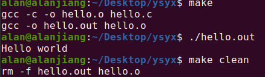

# PA

[TOC]

## 在移动硬盘搭建Ubuntu to go系统

-----

最初在笔记本中安装了Vmware的Ubuntu21.04系统但是虚拟机运行卡顿，系统窗口之间切换麻烦，于是准备干脆装个系统在移动硬盘，这样到哪里即插即用，体验颇好。然而，linux的安装并没有WIndows那样顺利，一波三折，这里大概记录当时遇到的几个主要问题。

### 安装包检验

[问题] 第一次安装到几乎完成，linux安装程序报错，文件损坏

[解决] 下载镜像后检验文件完整性，比对官方提供的SHA256值和本地文件的SHA256值，可以直接在Dos下使用命令计算

### EFI引导分区

[问题] 成功安装后，出现Ubuntu开机项，但是引导失败

[解决] 系统在搜索EFI引导的时候只能搜索前137GB，所以EFI引导分区必须在前137GB否则BIOS无法识别，因此EFI引导分区要建立在前137GB内

### Grub和UEFI引导

[问题] 成功在安装操作主机上使用Ubuntu，但是移除移动硬盘有可能造成主机无法启动或者无法在其他电脑中使用

[解决] inux是Grub引导，Windows是UEFI，如果原电脑有硬盘，安装Linux时虽然可以指定引导分区但是引导记录还是会写到默认第一块硬盘的引导分区方便加载 此时安装移动硬盘边和电脑绑定，必须修复移动硬盘中的引导或者把原主机硬盘屏蔽/物理拆除,才可以实现任意主机之间即插即用


## PA0

------

### 安装PA实验环境

```sh
sudo apt install libcanberra-gtk-module libcanberra-gtk3-module gconf2 gconf-service libappindicator1
```

### 输入法

使用Fcitx自带的Pinyin输入法，Sogou输入法对Ubuntu20以上版本支持有问题

### 配置Vim编辑器

这里使用[**Vimplus - An automatic configuration program for vim**](https://github.com/chxuan/vimplus)

**安装**

```sh
git clone https://github.com/chxuan/vimplus.git ~/.vimplus
cd ~/.vimplus
./install.sh
```

[**教程**](http://www.noobyard.com/article/p-batgcxzo-gu.html)

### GDB/Makefile

``` sh
vim hello.c
```

```c
/*hello.c*/
#include <stdio.h>                                                                                                            
int main()
{
    printf("Hello world\n");
    return 0;
}
```

``` sh
vim makefile
```

```makefile
# makefile
hello.out:hello.o
	gcc -o hello.out hello.o
hello.o:hello.c
	gcc -c -o hello.o hello.c
clean:
	rm -f hello.out hello.o
```

#### **运行结果**




### 安装Tmux

``` sh
sudo apt install tmux
```

[**教程**](https://www.ruanyifeng.com/blog/2019/10/tmux.html)


-----

## The Missing Semester of Your CS Education

### 添加man汉化手册

读英文手册有些关键词还是不熟，安装一个中文手册，添加一下命令防止覆盖cman

``` sh
sudo apt install manpages-zh
echo "alias cman='man -M /usr/share/man/zh_CN'" >>.bash_profile  #/usr/share/man/zh_CN是中文命令路径，不同环境可能不一样
source .bash_profile
```

### [Course overview + the shell](https://missing.csail.mit.edu/2020/course-shell/)

```sh
echo "\#\!/bin/sh">> semester        #采用\表示屏蔽转义字符   此语句指定执行bash
echo 'curl --head --silent https://missing.csail.mit.edu'>> missing/semester  #直接使用‘’
chmod 777 semester                #由于-rw-rw-r--  1 alan alan   61 1月   4 16:53 semester 没有执行权限，更改权限
./semester

HTTP/2 200 
server: GitHub.com
content-type: text/html; charset=utf-8
last-modified: Tue, 28 Dec 2021 15:04:25 GMT
access-control-allow-origin: *
etag: "61cb2779-1f31"
expires: Tue, 04 Jan 2022 09:06:14 GMT
cache-control: max-age=600
x-proxy-cache: MISS
x-github-request-id: A6EC:101B:262E49:2AC8AB:61D40BAE
accept-ranges: bytes
date: Tue, 04 Jan 2022 08:56:14 GMT
via: 1.1 varnish
age: 0
x-served-by: cache-hkg17931-HKG
x-cache: MISS
x-cache-hits: 0
x-timer: S1641286574.148349,VS0,VE268
vary: Accept-Encoding
x-fastly-request-id: f0242a379647c2ca34bf6b533caf0be20007eaed
content-length: 7985

#9.使用 | 和 > ，将 semester 文件输出的最后更改日期信息，写入主目录下的 last-modified.txt 的文件中
./semester | grep last > /tmp/lsat-modified.txt 

#10.写一段命令来从 /sys 中获取笔记本的电量信息，或者台式机 CPU 的温度。注意：macOS 并没有 sysfs，所以 Mac 用户可以跳过这一题。
cat /sys/class/power_supply/BAT1/capacity
```

### [Shell Tools and Scripting](https://missing.csail.mit.edu/2020/shell-tools/)

本节介绍了shell脚本和常用的shell工具的用法

```sh
#1.Read man ls and write an ls command that lists files in the following manner
	ls -al -h --sort=time --color=always
	# -al: 把所有的详细展开
	# -h: 以人性化的格式
	#--sort: 排序
	#--color: 颜色

```


```sh
#2.Write bash functions marco and polo that do the following. Whenever you execute marco the current working directory should be saved in some manner, then when you execute polo, no matter what directory you are in, polo should cd you back to the directory where you executed marco. For ease of debugging you can write the code in a file marco.sh and (re)load the definitions to your shell by executing source marco.sh.

# marco.sh:
#!/bin/bash
pwd > /home/alan/path

# polo.sh:
#!/bin/bash
cd $( cat /home/alan/path)

#为了能够在任何目录下执行 临时添加到用户路径
export PATH=$PATH:/home/alan
```

```sh
#3.Say you have a command that fails rarely. In order to debug it you need to capture its output but it can be time consuming to get a failure run. Write a bash script that runs the following script until it fails and captures its standard output and error streams to files and prints everything at the end. Bonus points if you can also report how many runs it took for the script to fail.
```


### [Editors (Vim)](https://missing.csail.mit.edu/2020/editors/)

### [Data Wrangling](https://missing.csail.mit.edu/2020/data-wrangling/)

### [Command-line Environment](https://missing.csail.mit.edu/2020/command-line/)

### [Version Control (Git)](https://missing.csail.mit.edu/2020/version-control/)

### [Debugging and Profiling](https://missing.csail.mit.edu/2020/debugging-profiling/)

### [Metaprogramming](https://missing.csail.mit.edu/2020/metaprogramming/)

### [Potpourri](https://missing.csail.mit.edu/2020/potpourri/)